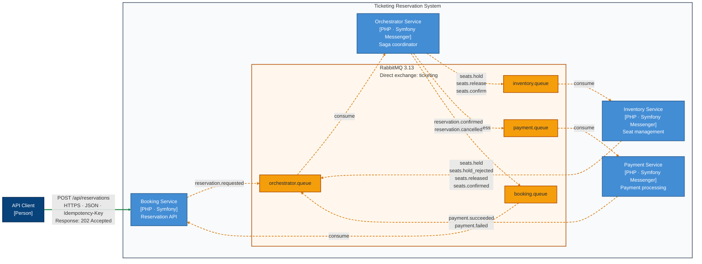

# Ticketing

Ticket reservation across four services: hold seats, process payment, then confirm the booking or release the seats on failure.

Each service owns its database. An orchestrated saga coordinates the workflow over RabbitMQ, with transactional outboxes and idempotent consumers. PostgreSQL integration tests exercise competing seat holds and saga transitions; E2E tests cover successful bookings, payment failure, and repeated message delivery.

**Stack:** PHP · Symfony · PostgreSQL · RabbitMQ · Docker Compose

## Design

- Concurrent reservations, transaction boundaries, and database locking.
- Idempotent APIs and consumers under at-least-once delivery.
- Reliable messaging with transactional Outbox / Inbox patterns.
- Saga coordination, compensation, and eventual consistency.

## Architecture

Booking, Inventory, Payment, and Orchestrator each own a separate PostgreSQL database and communicate through RabbitMQ.

Diagram source: [reservation-container.mmd](docs/diagrams/reservation-container.mmd).

## Reservation flow

The booking API accepts the request and records an outbox event. The saga then coordinates seat holding, payment, and confirmation or compensation.

Reservation creation: HTTP, idempotency, and outbox

[Open full-size diagram](docs/diagrams/reservation-flow-sequence.svg) · [PlantUML source](docs/diagrams/reservation-flow-sequence.puml)

Saga: confirmation, seat rejection, and payment failure

[Open full-size diagram](docs/diagrams/reservation-saga-sequence.svg) · [PlantUML source](docs/diagrams/reservation-saga-sequence.puml)

## Run and explore

Start with the [development setup](docs/dev-setup.md) for Docker Compose, the Reservation Console, and verification commands. See the [architecture guide](docs/architecture.md) for boundaries and trade-offs, and [current state](docs/current-state.md) for implemented scenarios and open work.

The payment gateway is fake; hold expiry, late-payment compensation, and a failed-message transport remain open work. Load testing is currently limited to HTTP acceptance.
