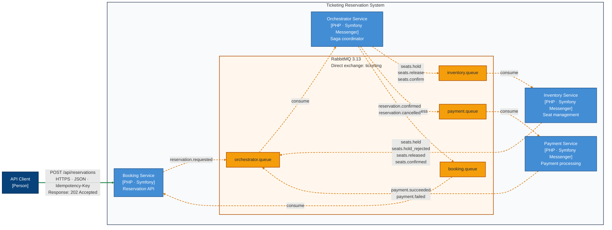
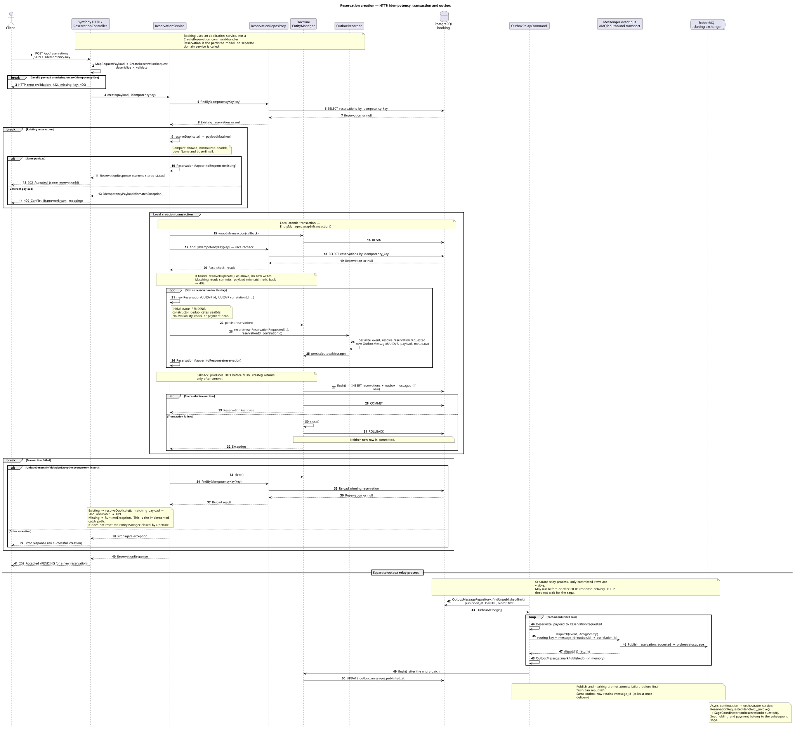
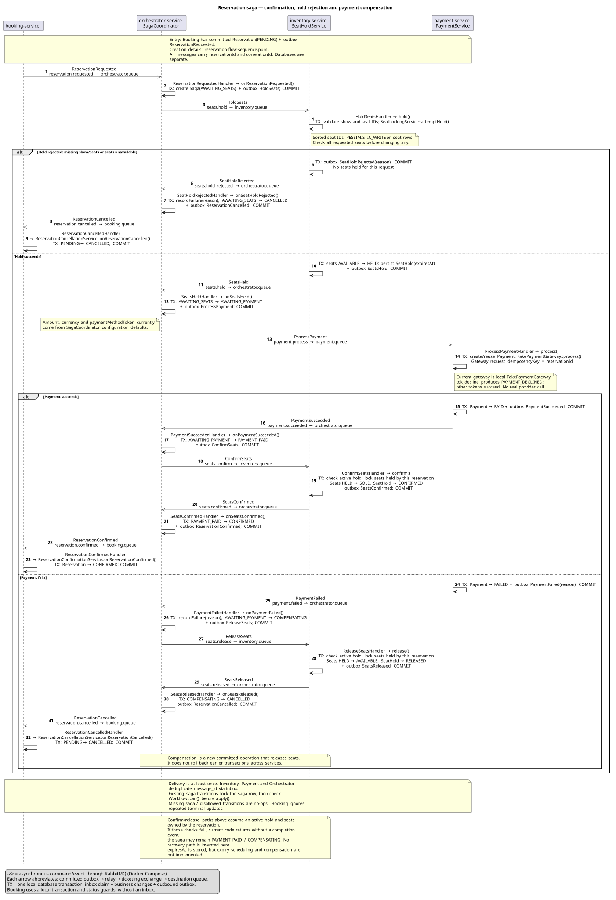

# Distributed Ticketing System

A production-oriented engineering sandbox for reservation correctness across four backend services: hold seats, process payment, then confirm or compensate. It focuses on concurrency, transaction boundaries, reliable messaging and failure handling; it is not a complete production ticketing platform.

**Stack:** PHP · Symfony · Doctrine · PostgreSQL · RabbitMQ · Docker Compose

## Why this project exists

- Prevent competing reservations from acquiring the same seat.
- Coordinate a checkout across independently committed databases.
- Preserve outgoing work when publishing fails and tolerate duplicate delivery.
- Release held seats after payment failure.

## Architecture



Booking owns reservations, Inventory owns the catalog and seats, Payment owns payment outcomes, and Orchestrator coordinates the workflow. Each service owns a PostgreSQL database. [Diagram source](docs/diagrams/reservation-container.mmd).

## Key engineering decisions

- [PostgreSQL row locks](docs/architecture.md#6-concurrency-acquiring-seats) for multi-seat read → validate → modify operations, acquired in sorted order.
- [Transactional outboxes](docs/architecture.md#publishing-committed-work) for publishing committed work through separate relays.
- [Transactional inbox claims](docs/architecture.md#handling-repeated-delivery) for duplicate messages; Booking uses repeat-safe status updates.
- [Saga orchestration](docs/architecture.md#4-distributed-workflow-and-failure-recovery) for explicit workflow state and payment-failure compensation.

## Example flow

Reservation → seat hold → payment → seats sold → reservation confirmed.

HTTP `202` acknowledges creation; the final outcome arrives asynchronously.

<details>
<summary>Reservation creation: HTTP, idempotency, and outbox</summary>



[Open full-size diagram](docs/diagrams/reservation-flow-sequence.svg) · [PlantUML source](docs/diagrams/reservation-flow-sequence.puml)

</details>

<details>
<summary>Saga: confirmation, seat rejection, and payment failure</summary>



[Open full-size diagram](docs/diagrams/reservation-saga-sequence.svg) · [PlantUML source](docs/diagrams/reservation-saga-sequence.puml)

</details>

## Running locally

With Docker and Docker Compose v2, run from the repository root:

```bash
docker compose up -d --build
docker compose exec inventory-worker php bin/console app:inventory:seed-seats sample-show A1 A2 --name="Sample Show"
```

Open the [Reservation Console](http://localhost:8082). See [development setup](docs/dev-setup.md) for HTTP requests, ports and troubleshooting.

## Tests

- [Inventory](services/inventory-service/tests/) and [payment](services/payment-service/tests/) PHPUnit suites exercise service behavior and duplicate delivery through Symfony and Doctrine; these are integration tests, not a separate unit-test suite.
- Real PostgreSQL contention: [seat holds](tests/integration/inventory-concurrency.sh) and [saga transitions](tests/integration/saga-concurrency.sh), including commit and rollback.
- RabbitMQ E2E: [happy path + redelivery](tests/e2e/happy-path-idempotency.sh) and [payment failure + redelivery](tests/e2e/payment-failure.sh).
- [k6 HTTP acceptance tests](tests/load/README.md); completed-checkout throughput is not measured.

[Test commands and coverage limits](docs/dev-setup.md#verification)

## Scope and limitations

- Payment uses a fake gateway and configured amount/currency; there is no real provider integration or checkout pricing.
- Holds store an expiry timestamp, but expiration and abandoned-checkout compensation are not implemented.
- Late or uncertain payment outcomes have no reconciliation, void or refund path.
- Verification covers single-seat contention and existing-saga transitions; multi-seat contention, crash recovery and completed-checkout throughput remain unverified.
- Runtime targets local Docker Compose. Production retry/DLQ handling, observability and deployment are not configured.

## Documentation

- [Architecture and implementation entry points](docs/architecture.md)
- [Development setup and verification](docs/dev-setup.md)
- [Component and sequence diagrams](docs/diagrams/)
